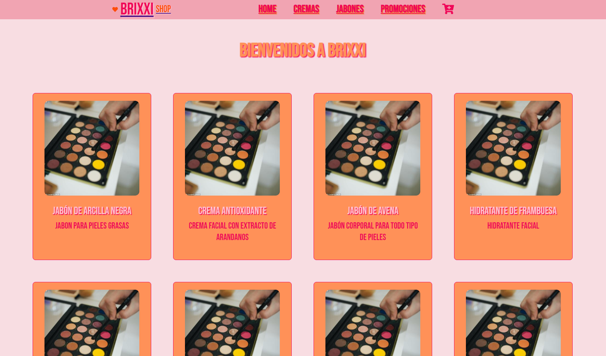

# Brixxi Shop

Brixxi Shop es un proyecto de tipo e-commerce, creado en ReactJs, con una conexión a Firebase como backend y pensado para escalarlo con vinculación a otras tecnologías.

## Estado del proyecto

El mismo se encuentra en etapa de crecimiento, la intención es agregar todos los servicios de Firebase, medios de pago y auto gestión.

### Instalación

Debe tener instalado node v16.15 y npm v8.5.5 o superior
Puede clonar el proyecto con git utilizando el comando:
```git 
  git clone https://https://github.com/abrilmeza21/Brixxi-app-Meza.git
 ```
y luego ejecutar el comando 

```git 
  npm install
 ```
## Soporte
De encontrar algún problema o bug, se agradece si se puede notificar a abrilmmp20@gmail.com.

## Hoja de ruta
Se espera que a futuro, el proyecto incorpore mas funcionalidades mediante el desarrollo back-end.

## Contribución
Este proyecto utiliza varias librerías que facilitan su desarrollo por lo que agradezco a los proyectos:
* [react-icons](https://react-icons.github.io/react-icons) agregando muchos íconos
* [sweetalert2](https://sweetalert2.github.io/) brindando feedback al usuario con carteles elegantes y sencillos de uti

## Visuales


__Producto__


El usuario podrá filtrar el conjuto de productos mediante categorías, una vez visto el producto que se desea, el usuario podrá hacer click en el mismo para ser dirigido a una nueva pantalla, donde se encuentra la descripción del producto y un itemCounter que le permitirá seleccionar la cantidad y llevarlo a un carrito de compras.

## Descripción del diseño
Cuenta con un __Header__ en el que se incluye una barra de navegación, la misma esta constituida por una marca , categorías, un ícono de un carrito de compras y botones para registrarse o ingresar.
Tiene dos estados, uno para páginas desktop y otro para pantallas mobile. 

__Barra Desktop__


Un __Main__,  donde se encuentra la información llamada por la barra de navegación, tales como productos y detalles de los mismos.

__Main con todas las categorías en versión desktop y luego en versión para mobile__




## Librerías usadas
### Predeterminadas de Create React Aplication
*    react ^18.1.0
*    react-dom 18.1.0
*    react-scripts ^5.0.1


### Librerías de navegación
*    [react-router-dom ^6.3.0](https://reactrouter.com/)

### Otras librerías

* [react-icons](https://react-icons.github.io/react-icons) agregando muchos íconos
* [material ui](https://mui.com/) agregando estética y diseño a los componentes
* [sweetalert2](https://sweetalert2.github.io/) brindando feedback al usuario con carteles elegantes y sencillos de utilizar


### Muestra en github page
*    [universo3d](https://6320b69246eae81c94cdb3a1--charming-cheesecake-36d9a9.netlify.app/)


